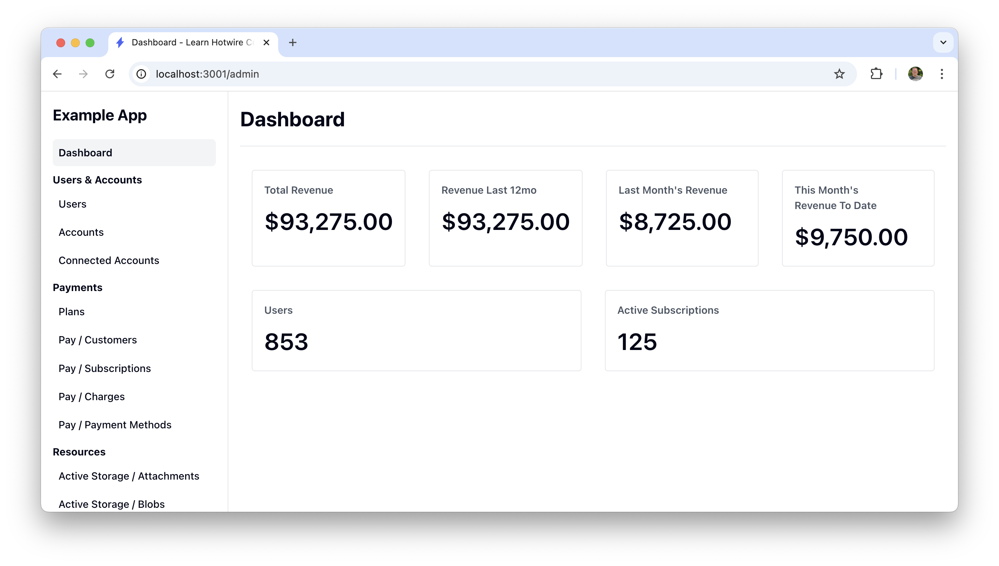

# Madmin

### 🛠 A robust Admin Interface for Ruby on Rails apps

[](https://github.com/excid3/madmin/actions) [](https://badge.fury.io/rb/madmin)

Why another Ruby on Rails admin? We wanted an admin that was:

* Familiar and customizable like Rails scaffolds (less DSL)
* Supports all the Rails features out of the box (ActionText, ActionMailbox, has_secure_password, etc)
* Stimulus / Turbolinks / Hotwire ready


_We're still working on the design!_

## Installation
Add `madmin` to your application's Gemfile:

```bash
bundle add madmin
```

Then run the madmin generator:

```bash
rails g madmin:install
```

This will install Madmin and generate resources for each of the models it finds.

## Resources

Madmin uses `Resource` classes to add models to the admin area.

### Generate a Resource

To generate a resource for a model, you can run:

```bash
rails g madmin:resource ActionText::RichText
```

## Configuring Views

The views packaged within the gem are a great starting point, but inevitably people will need to be able to customize those views.

You can use the included generator to create the appropriate view files, which can then be customized.

For example, running the following will copy over all of the views into your application that will be used for every resource:
```bash
rails generate madmin:views
```

The view files that are copied over in this case includes all of the standard Rails action views (index, new, edit, show, and _form), as well as:
* `application.html.erb` (layout file)
* `_javascript.html.erb` (default JavaScript setup)
* `_navigation.html.erb` (renders the navigation/sidebar menu)

As with the other views, you can specifically run the views generator for only the navigation or application layout views:
```bash
rails g madmin:views:navigation
 # -> app/views/madmin/_navigation.html.erb

rails g madmin:views:layout  # Note the layout generator includes the layout, javascript, and navigation files.
 # -> app/views/madmin/application.html.erb
 # -> app/views/madmin/_javascript.html.erb
 # -> app/views/madmin/_navigation.html.erb
```

If you only need to customize specific views, you can restrict which views are copied by the generator:
```bash
rails g madmin:views:index
 # -> app/views/madmin/application/index.html.erb
```

You might want to make some of your model's attributes visible in some views but invisible in others.
The `attribute` method in model_resource.rb gives you that flexibility.

```bash
 # -> app/madmin/resources/book_resource.rb
```
```ruby
class UserResource < Madmin::Resource
  attribute :id, form: false
  attribute :tile
  attribute :subtitle, index: false
  attribute :author
  attribute :genre
  attribute :pages, show: false
end
```

You can also scope the copied view(s) to a specific Resource/Model:
```bash
rails generate madmin:views:index Book
 # -> app/views/madmin/books/index.html.erb
```

## Custom Fields

You can generate a custom field with:

```bash
rails g madmin:field Custom
```

This will create a `CustomField` class in `app/madmin/fields/custom_field.rb`
And the related views:

```bash
# -> app/views/madmin/fields/custom_field/_form.html.erb
# -> app/views/madmin/fields/custom_field/_index.html.erb
# -> app/views/madmin/fields/custom_field/_show.html.erb
```

You can then use this field on our resource:

```ruby
class PostResource < Madmin::Resource
  attribute :title, field: CustomField
end
```

## Authentication

You can use a couple of strategies to authenticate users who are trying to
access your madmin panel: [Authentication Docs](docs/authentication.md)

## 🙏 Contributing

This project uses Standard for formatting Ruby code. Please make sure to run standardrb before submitting pull requests.

## 📝 License
The gem is available as open source under the terms of the [MIT License](https://opensource.org/licenses/MIT).
