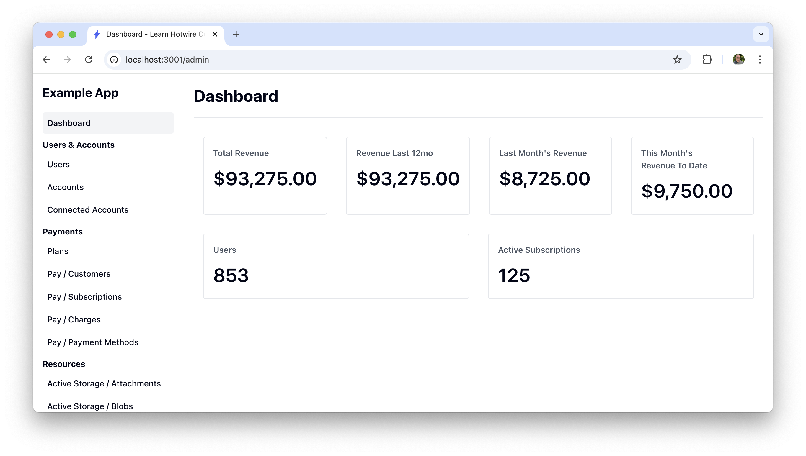

# Madmin

### 🛠 A robust Admin Interface for Ruby on Rails apps

[](https://github.com/excid3/madmin/actions) [](https://badge.fury.io/rb/madmin)

Why another Ruby on Rails admin? We wanted an admin that was:

- Familiar and customizable like Rails scaffolds (less DSL)
- Supports all the Rails features out of the box (ActionText, ActionMailbox, has_secure_password, etc)
- Stimulus / Turbolinks / Hotwire ready
- Works with Import maps and Sprockets



## Installation

Add `madmin` to your application's Gemfile:

```bash
bundle add madmin
```

Then run the madmin generator:

```bash
rails g madmin:install
```

This will install Madmin and generate resources for each of the models it finds.

## Resources

Madmin uses `Resource` classes to add models to the admin area.

### Generate a Resource

To generate a resource for a model, you can run:

```bash
rails g madmin:resource ActionText::RichText
```

### Avoid N+1 queries

In case of N+1 queries, you can preload the association by overriding the `scoped_resource` method in the controller:

```ruby
module Madmin
  class PostsController < Madmin::ResourceController
    private

    def scoped_resources
      super.includes(:user)
    end
  end
end

```

### Read-only Resources

To expose a resource in the admin without allowing writes, override `readonly?` in the resource:

```ruby
class AuditLogResource < Madmin::Resource
  def self.readonly?
    true
  end
end
```

The new, edit, and delete links are hidden for read-only resources, and any write actions redirect back to the index.

### Scopes

Declare scopes on a resource to render filter buttons on the index page. Each scope must be a scope or class method on the model:

```ruby
class PostResource < Madmin::Resource
  scope :published
  scope :draft
end
```

Button labels default to the humanized scope name. To customize or translate them, define an I18n key — `madmin.scopes.<param_key>.<scope>` for one resource, or `madmin.scopes.<scope>` shared across resources:

```yaml
en:
  madmin:
    scopes:
      post:
        published: Live
```

For labels that need logic (e.g. looking up a record name), override `scope_label`:

```ruby
class PostResource < Madmin::Resource
  def self.scope_label(name)
    name.to_s.titleize
  end
end
```

## Configuring Views

The views packaged within the gem are a great starting point, but inevitably people will need to be able to customize those views.

You can use the included generator to create the appropriate view files, which can then be customized.

For example, running the following will copy over all of the views into your application that will be used for every resource:

```bash
rails generate madmin:views
```

The view files that are copied over in this case includes all of the standard Rails action views (index, new, edit, show, and \_form), as well as:

- `application.html.erb` (layout file)
- `_javascript.html.erb` (default JavaScript setup)
- `_navigation.html.erb` (renders the navigation/sidebar menu)

As with the other views, you can specifically run the views generator for only the navigation or application layout views:

```bash
rails g madmin:views:navigation
 # -> app/views/madmin/_navigation.html.erb

rails g madmin:views:layout  # Note the layout generator includes the layout, javascript, and navigation files.
 # -> app/views/madmin/application.html.erb
 # -> app/views/madmin/_javascript.html.erb
 # -> app/views/madmin/_navigation.html.erb
```

If you only need to customize specific views, you can restrict which views are copied by the generator:

```bash
rails g madmin:views:index
 # -> app/views/madmin/application/index.html.erb
```

You might want to make some of your model's attributes visible in some views but invisible in others.
The `attribute` method in model_resource.rb gives you that flexibility.

```bash
 # -> app/madmin/resources/book_resource.rb
```

```ruby
class BookResource < Madmin::Resource
  attribute :id, form: false
  attribute :title
  attribute :subtitle, index: false
  attribute :author
  attribute :genre
  attribute :pages, show: false
end
```

You can also scope the copied view(s) to a specific Resource/Model:

```bash
rails generate madmin:views:index Book
 # -> app/views/madmin/books/index.html.erb
```

### Specifying Field Types

You can set a field type as the second argument. Field types may have additional options to render the field UI.


For example, we can use a select for the genre attribute and specify the collection of options to choose from.

```ruby
class BookResource < Madmin::Resource
  attribute :genre, :select, collection: ["Fiction", "Mystery", "Thriller"]
end
```

## Custom Fields

You can generate a custom field with:

```bash
rails g madmin:field Custom
```

This will create a `CustomField` class in `app/madmin/fields/custom_field.rb`
And the related views:

```bash
# -> app/views/madmin/fields/custom_field/_form.html.erb
# -> app/views/madmin/fields/custom_field/_index.html.erb
# -> app/views/madmin/fields/custom_field/_show.html.erb
```

You can then use this field on our resource:

```ruby
class PostResource < Madmin::Resource
  attribute :title, field: CustomField
end
```

## Actions

### Member Actions

`member_action` lets you add custom buttons to a resource's **show** page. Each block receives the current `record` and is rendered in the header's `.actions` div:

```ruby
class PostResource < Madmin::Resource
  member_action do |record|
    link_to "Publish", publish_admin_post_path(record), class: "btn btn-secondary"
  end
end
```

Pass `collection: true` to also render the action on the **index** page, in each row next to the built-in "View" and "Edit" links:

```ruby
class PostResource < Madmin::Resource
  member_action collection: true do |record|
    link_to "Publish", publish_admin_post_path(record), class: "btn btn-secondary"
  end
end
```

### Collection Actions

`collection_action` is the index-page counterpart to `member_action`. Blocks are rendered in the index header's `.actions` div, immediately before the built-in "New \<Resource\>" link.

Unlike `member_action`, blocks receive **no** arguments. Each block is `instance_exec`-ed on the index view context, so `link_to`, route helpers, `policy`, `current_user`, `params`, `resource`, and `@records` are all available. Multiple blocks render in registration order.

Each block is responsible for its own authorization gating — if a button should be hidden for some users, guard it inside the block.

```ruby
class PostResource < Madmin::Resource
  collection_action do
    link_to "Bulk Import", bulk_import_admin_posts_path, class: "btn btn-secondary"
  end

  collection_action do
    link_to "Export CSV", export_admin_posts_path(format: :csv), class: "btn btn-secondary"
  end
end
```

## Extending Madmin

Madmin runs `ActiveSupport` load hooks on its core classes so you can extend them from an initializer without reopening or monkey patching them. This is the recommended way for engines and gems to add behavior to Madmin.

| Hook | Base | Use it for |
| --- | --- | --- |
| `:madmin_resource` | `Madmin::Resource` | Adding to the resource DSL |
| `:madmin_field` | `Madmin::Field` | Shared behavior across every field type |
| `:madmin_search` | `Madmin::Search` | Customizing how the search query is built |
| `:madmin_base_controller` | `Madmin::BaseController` | Layouts, helpers, `rescue_from`, authentication |
| `:madmin_resource_controller` | `Madmin::ResourceController` | CRUD callbacks, scoping records, audit logging |

Blocks are `class_eval`-ed on the base class, so `self` is the class itself:

```ruby
# config/initializers/madmin.rb
ActiveSupport.on_load(:madmin_resource) do
  # self == Madmin::Resource, so `extend` adds class-level DSL to every resource
  extend MyAdmin::ResourceExtensions
end

ActiveSupport.on_load(:madmin_base_controller) do
  # self == Madmin::BaseController
  rescue_from Pundit::NotAuthorizedError, with: :admin_not_authorized
end
```

Hooks registered after a class has already loaded run immediately, so ordering in your initializers doesn't matter. The controllers live in the engine's `app/` directory and are reloadable, which means their hooks re-run on every reload in development — keep the blocks idempotent.

## Authentication

You can use a couple of strategies to authenticate users who are trying to
access your madmin panel: [Authentication Docs](docs/authentication.md)

## Assets
You can customize the JavaScript and CSS assets used by Madmin for your application. To learn how
see the [Assets Doc](docs/assets.md)

## 🙏 Contributing

This project uses Standard for formatting Ruby code. Please make sure to run standardrb before submitting pull requests.

## 📝 License

The gem is available as open source under the terms of the [MIT License](https://opensource.org/licenses/MIT).
